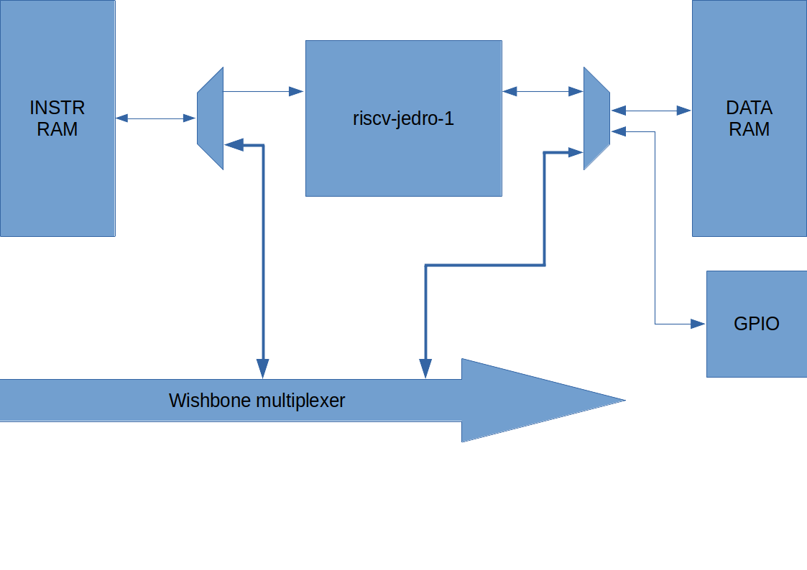

# rvj1\_caravel\_soc 

This repository contains a very simple SoC using the riscv-jedro-1 processor design.

Logic analyzer pins:
	0       INPUT  jedro_1_rstn (reset bar of the user logic)
	1       INPUT  sel_wb (If this is selected the caravel controlled wishbone can write to INSTR and DATA RAM)
	2-34    OUTPUT time_ff register (of timer.v) value.
	35-67   OUTPUT cpu2imux_addr
	68-100  OUTPUT cpu2imux_rdata
	100-124 OUTPUT gpio_out
	124-127 OUTPUT constant zero

